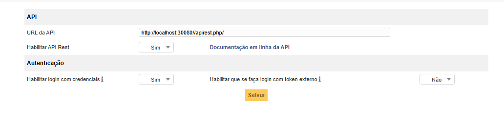

# ANALISE DE LOGS INFRA API REST GLPI

Configuração basica para funcionamento da Api Rest GLPI

 <!-- Placeholder for a banner image; replace with actual if available -->

Conforme a imagem a cima mosta a opção Habilitar que se faça login com token externo esta desativado para usar login pelo token direto sem uso de login e password 

configuração basica no header para uso sem token externo

````ts
headers: {
  'Content-Type': "application/json",
  'App-Token': "Token do glpi",
}
````

````ts
body: {
  login: "usuario",
  password: "password"
}
````

Com token externo ativado 

````ts
headers: {
  'Content-Type': "application/json",
  'App-Token' : "Token do glpi",
  'Session-Token': "Token do usuário"
}
````

----
<br>

Configurações basica para ativar o serviço da API REST

 <!-- Placeholder for a banner image; replace with actual if available -->

No Intervalo de endereço IPv4

`Se o servidor tem mudança de ip, configurar seguinte range de ip`

- 1.0.0.0 - 255.255.255.255